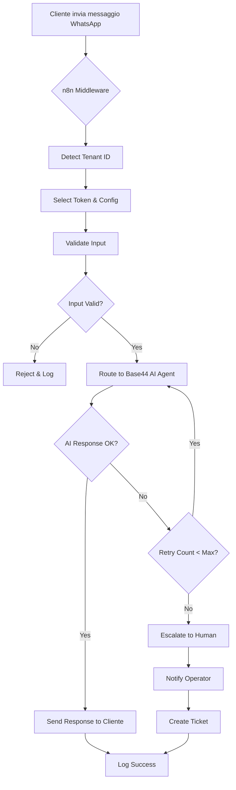
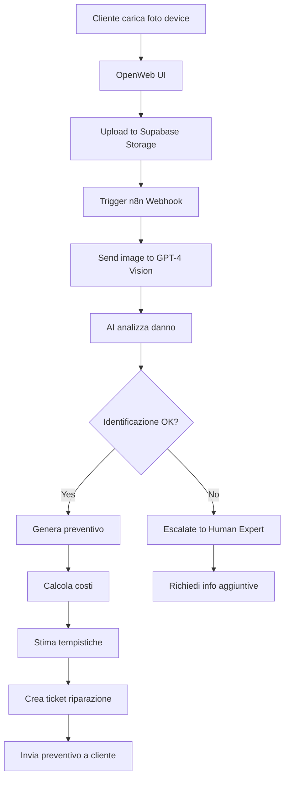

# 🚀 PIANO OPERATIVO WAIPRO - ECOSISTEMA AI MULTI-TENANT

**Creato:** 5 Novembre 2025
**Autore:** Claude Code per Waipro Agency
**Stato:** 🔴 IN ESECUZIONE
**Clienti:** Mister Phone TEC & Ripara Subito TEC

---

## 📋 EXECUTIVE SUMMARY

### Chi Siamo
**Waipro Agency** - Agenzia digitale AI-driven specializzata in automazioni scalabili con Base44, n8n e integrazioni AI, WhatsApp e social media.

### Obiettivo
Costruire e mantenere un **ecosistema AI multi-tenant robusto** per:
- ✅ Assistenza clienti automatizzata via WhatsApp
- ✅ Gestione riparazioni e prenotazioni
- ✅ Prevenzione loop e retry infiniti
- ✅ Escalation automatica a operatori umani
- ✅ Social login sicuro e brandizzato
- ✅ Esperienza utente avanzata
- ✅ Automazione sviluppo e deploy

---

## 🏗️ ARCHITETTURA ATTUALE

### Stato Infrastruttura Esistente

```
┌────────────────────────────────────────────────────────────┐
│                   WAIPRO ECOSYSTEM                         │
├────────────────────────────────────────────────────────────┤
│                                                            │
│  🌐 FRONTEND LAYER                                        │
│  ├─ Base44 Apps (Mister Phone + Ripara Subito)           │
│  ├─ OpenWeb UI (in piano)                                 │
│  └─ Custom Domains (*.waipro.it)                          │
│                                                            │
│  🤖 AI & AUTOMATION LAYER                                 │
│  ├─ Claude Code Pro (via OpenRouter)                      │
│  ├─ Base44 AI Agents                                      │
│  ├─ Comet.ai Pro (browser automation - in piano)          │
│  └─ MCP Servers (Perplexity, GitHub, etc.)               │
│                                                            │
│  ⚙️  ORCHESTRATION LAYER                                   │
│  ├─ n8n (n8n.waipro.it) - ATTIVO                         │
│  │   ├─ WhatsApp Multi-tenant Middleware                 │
│  │   ├─ Circuit Breaker & Retry Logic                    │
│  │   ├─ Escalation & Fallback Handlers                   │
│  │   └─ RAG Auto-update                                  │
│  └─ Zapier (alternative flows)                            │
│                                                            │
│  💾 DATA & BACKEND LAYER                                  │
│  ├─ Supabase (PostgreSQL + Auth + Storage)               │
│  ├─ Base44 Internal DB                                    │
│  └─ Vector Store (RAG embeddings)                         │
│                                                            │
│  🔐 AUTH & SECURITY LAYER                                 │
│  ├─ Auth0 OAuth2 Proxy (in piano)                        │
│  ├─ Google OAuth (configurato)                            │
│  ├─ Base44 SSO                                            │
│  └─ WhatsApp Business API Tokens                          │
│                                                            │
│  🖥️  INFRASTRUCTURE LAYER                                 │
│  ├─ VPS Hostinger (middleware + dev env)                 │
│  ├─ Docker Compose (n8n + nginx + certbot)               │
│  ├─ DNS: GoDaddy (n8n.waipro.it configurato)             │
│  └─ SSL: Let's Encrypt via Certbot                        │
│                                                            │
└────────────────────────────────────────────────────────────┘
```

### Componenti Già Implementati ✅

| Componente | Stato | Path/URL | Note |
|------------|-------|----------|------|
| **Knowledge Base** | ✅ ATTIVO | `/home/user/waipro-knowledge-base` | Repository GitHub con docs |
| **n8n Server** | ✅ CONFIGURATO | `n8n.waipro.it` | Docker compose ready |
| **n8n Workflows** | ✅ PRONTI | `/n8n-workflows/` | 4 workflow base |
| **Docker Setup** | ✅ ATTIVO | `docker-compose.yml` | n8n + nginx + certbot |
| **DNS Config** | ✅ PROPAGATO | GoDaddy AAAA record | n8n.waipro.it |
| **SSL Certificates** | ✅ CONFIGURATO | Let's Encrypt | Certbot automation |
| **Base44 OAuth Guide** | ✅ COMPLETO | `/DOCS/BASE44-SOCIAL-LOGIN-WAIPRO-GUIDE.md` | Google OAuth pronto |
| **Comet.ai Strategy** | ✅ DOCUMENTATO | `/DOCS/COMET-AI-INTEGRATION-STRATEGY.md` | Piano integrazione |
| **Master Guide** | ✅ COMPLETO | `/DOCS/MASTER-GUIDE-BASE44-N8N-MCP.md` | Guida completa ecosistema |
| **MCP Servers** | ✅ CONFIGURATI | `/perplexity-mcp/` | Perplexity integration |
| **Base44 SDK** | ✅ DISPONIBILE | `/base44-sdk/` | SDK per Supabase migration |

---

## 🎯 PROBLEMI CHIAVE DA RISOLVERE (CAP)

### 1. Loop Infiniti & Retry Chatbot Base44 🔴

**Problema:**
- Chatbot Base44 può entrare in loop infiniti
- Retry senza limite causano crash e costi elevati
- Nessun circuit breaker implementato

**Soluzione:**
```javascript
// n8n Middleware con Circuit Breaker
const MAX_RETRIES = 2;
const CIRCUIT_TIMEOUT = 30000; // 30s

if (retryCount > MAX_RETRIES) {
  // Trigger fallback to human operator
  await escalateToHuman(conversationId);
  return { status: 'escalated' };
}
```

**Best Practice:**
- ✅ Circuit breaker con max 2-3 retry
- ✅ Filtraggio input/output rigido
- ✅ Modalità Discuss per test sicuri
- ✅ Logging completo per debug

**Fonti:**
- https://docs.n8n.io/automation/retry-limitations/
- https://docs.base44.com/Guides/AI-chat-modes#discuss-mode

---

### 2. Multi-tenant WhatsApp 🔴

**Problema:**
- Gestire più clienti (Mister Phone + Ripara Subito) con token separati
- Evitare conflitti e cross-contamination messaggi
- Scalare a nuovi clienti facilmente

**Soluzione Architetturale:**

```
┌──────────────┐
│  WhatsApp    │
│  Business    │
│     API      │
└──────┬───────┘
       │
       ▼
┌──────────────────────────────────────┐
│   n8n ORCHESTRATOR MIDDLEWARE        │
│                                      │
│  ┌────────────────────────────────┐ │
│  │  Token Router                  │ │
│  │  - Tenant ID detection         │ │
│  │  - Token selection             │ │
│  │  - Rate limiting               │ │
│  └────────────────────────────────┘ │
│                                      │
│  ┌────────────────────────────────┐ │
│  │  Message Validator             │ │
│  │  - Input sanitization          │ │
│  │  - Format checking             │ │
│  │  - Spam detection              │ │
│  └────────────────────────────────┘ │
│                                      │
│  ┌────────────────────────────────┐ │
│  │  Circuit Breaker               │ │
│  │  - Retry limit (2-3 max)       │ │
│  │  - Error tracking              │ │
│  │  - Auto-escalation             │ │
│  └────────────────────────────────┘ │
└──────────────┬───────────────────────┘
               │
               ▼
    ┌──────────────────────┐
    │  Base44 AI Agent     │
    │  (per tenant)        │
    └──────────────────────┘
```

**Configurazione Token:**

```javascript
// n8n Environment Variables
const TENANTS = {
  'mister-phone': {
    name: 'Mister Phone TEC',
    whatsapp_token: process.env.WHATSAPP_TOKEN_MISTERPHONE,
    whatsapp_phone_id: process.env.WHATSAPP_PHONE_MISTERPHONE,
    base44_agent_id: process.env.BASE44_AGENT_MISTERPHONE,
    escalation_webhook: 'https://n8n.waipro.it/webhook/escalate-misterphone'
  },
  'ripara-subito': {
    name: 'Ripara Subito TEC',
    whatsapp_token: process.env.WHATSAPP_TOKEN_RIPARASUBITO,
    whatsapp_phone_id: process.env.WHATSAPP_PHONE_RIPARASUBITO,
    base44_agent_id: process.env.BASE44_AGENT_RIPARASUBITO,
    escalation_webhook: 'https://n8n.waipro.it/webhook/escalate-riparasubito'
  }
};

// Detect tenant from incoming message
function detectTenant(phoneNumber) {
  // Logic to determine tenant based on recipient number
  if (phoneNumber === TENANTS['mister-phone'].whatsapp_phone_id) {
    return 'mister-phone';
  }
  return 'ripara-subito';
}
```

**Fonti:**
- https://github.com/Micky90-sys/multi-tenant-whatsapp-integration
- https://docs.n8n.io/integrations/builtin/app-whatsapp/

---

### 3. Escalation Automatica a Operatori Umani 🔴

**Problema:**
- Chatbot non sa quando passare a umano
- Cliente frustrato se AI non risolve
- Mancanza di monitoring e notifiche

**Soluzione n8n Workflow:**

```javascript
// Trigger Conditions for Escalation
const ESCALATION_TRIGGERS = [
  'retry_limit_exceeded',      // Max retry raggiunto
  'confidence_score_low',       // AI confidence < 70%
  'explicit_request',           // User chiede "voglio parlare con operatore"
  'complex_query_detected',     // Query troppo complessa
  'error_consecutive'           // 3+ errori consecutivi
];

async function checkEscalationNeeded(context) {
  if (context.retryCount >= MAX_RETRIES) {
    return await escalate(context, 'retry_limit_exceeded');
  }

  if (context.aiConfidence < 0.7) {
    return await escalate(context, 'confidence_score_low');
  }

  if (detectHumanRequest(context.message)) {
    return await escalate(context, 'explicit_request');
  }

  return false;
}

async function escalate(context, reason) {
  // 1. Notify operator via Telegram/Email/SMS
  await notifyOperator({
    tenant: context.tenant,
    customer: context.customerPhone,
    reason: reason,
    conversation: context.history,
    priority: calculatePriority(reason)
  });

  // 2. Update conversation status
  await updateConversationStatus(context.conversationId, 'ESCALATED');

  // 3. Send message to customer
  await sendWhatsAppMessage(
    context.customerPhone,
    "Un nostro operatore ti contatterà a breve. Grazie per la pazienza! 🙏"
  );

  // 4. Create ticket in system
  const ticket = await createTicket({
    tenant: context.tenant,
    customer: context.customerPhone,
    subject: `Escalation: ${reason}`,
    description: context.summary,
    priority: calculatePriority(reason)
  });

  return { escalated: true, ticketId: ticket.id };
}
```

**Dashboard Notifiche:**
- Telegram Bot per alert real-time
- Email digest giornaliero
- SMS per urgenze (priority: HIGH)
- Dashboard web con queue operatori

**Fonte:**
- https://docs.base44.com/Guides/AI-chat-modes#fallback-and-escalation

---

### 4. Social Login con Auth0 (Bypass Restrizioni Google) 🟡

**Problema:**
- Restrizioni Google OAuth per app non verificate
- Badge "base44.com" visibile durante login
- Tempo approvazione Google: 3-7 giorni

**Soluzione: Auth0 come Proxy OAuth2**

```
┌──────────────┐
│   User       │
└──────┬───────┘
       │ 1. Click "Login with Google"
       ▼
┌──────────────────────┐
│  App Base44          │
│  (waipro branding)   │
└──────┬───────────────┘
       │ 2. Redirect to Auth0
       ▼
┌──────────────────────┐
│  Auth0 Proxy         │
│  (Custom Domain)     │
│  auth.waipro.it      │
└──────┬───────────────┘
       │ 3. Redirect to Google
       ▼
┌──────────────────────┐
│  Google OAuth        │
│  (White-label)       │
└──────┬───────────────┘
       │ 4. Token return
       ▼
┌──────────────────────┐
│  Auth0 Proxy         │
│  - Enrichment        │
│  - Custom claims     │
└──────┬───────────────┘
       │ 5. Final token
       ▼
┌──────────────────────┐
│  Base44 App          │
│  User logged in ✅   │
└──────────────────────┘
```

**Configurazione Auth0:**

1. **Setup Auth0 Tenant:**
   - Nome: `waipro-prod`
   - Region: EU (GDPR compliant)
   - Custom Domain: `auth.waipro.it`

2. **Configure Google Connection:**
   ```json
   {
     "name": "google-oauth2",
     "strategy": "google-oauth2",
     "enabled_clients": ["base44-misterphone", "base44-riparasubito"],
     "options": {
       "client_id": "YOUR_GOOGLE_CLIENT_ID",
       "client_secret": "YOUR_GOOGLE_CLIENT_SECRET",
       "allowed_audiences": [],
       "scopes": ["email", "profile", "openid"]
     }
   }
   ```

3. **Custom Branding:**
   - Logo: Waipro + Cliente
   - Colors: Brand cliente
   - Email templates personalizzati
   - Terms & Privacy links

**Vantaggi:**
- ✅ Nessun badge "base44.com"
- ✅ Branding 100% personalizzato
- ✅ Multi-provider (Google + Microsoft + GitHub + Facebook)
- ✅ MFA built-in
- ✅ Analytics e monitoring
- ✅ Compliance GDPR

**Costi:**
- Auth0 Free Tier: 7000 utenti attivi/mese
- Più che sufficiente per Mister Phone + Ripara Subito

**Fonti:**
- https://auth0.com/docs/quickstart/webapp
- https://auth0.com/docs/customize/custom-domains

---

### 5. OpenWeb UI - Esperienza Utente Avanzata 🟡

**Obiettivo:**
- Upload files (foto device rotti)
- Drag & drop allegati
- Chat history persistente
- Multi-modal (testo + immagini + voice)
- Sfruttare bonus Base44 Pro

**Architettura:**

```
┌────────────────────────────────────┐
│  OpenWeb UI Frontend               │
│  (React/Next.js)                   │
│  ┌──────────────────────────────┐ │
│  │  Chat Interface              │ │
│  │  - Real-time messages        │ │
│  │  - File upload area          │ │
│  │  - Voice input button        │ │
│  │  - Drag & drop zone          │ │
│  └──────────────────────────────┘ │
└───────────┬────────────────────────┘
            │
            ▼
┌────────────────────────────────────┐
│  Backend API (Next.js API Routes) │
│  ┌──────────────────────────────┐ │
│  │  /api/chat                   │ │
│  │  /api/upload                 │ │
│  │  /api/voice                  │ │
│  └──────────────────────────────┘ │
└───────────┬────────────────────────┘
            │
     ┌──────┴─────────┐
     ▼                ▼
┌─────────┐    ┌──────────────┐
│ Base44  │    │  Supabase    │
│ AI      │    │  Storage     │
│ Agent   │    │  (files)     │
└─────────┘    └──────────────┘
```

**Features Prioritarie:**

1. **File Upload per Riparazioni:**
   - User carica foto device rotto
   - AI analizza immagine (GPT-4 Vision)
   - Stima costi e tempistiche
   - Crea preventivo automatico

2. **Voice Input:**
   - Utente parla invece di scrivere
   - Transcription via Whisper API
   - Risposta audio (TTS) opzionale

3. **History & Context:**
   - Conversazioni salvate
   - Ripresa contesto automatica
   - Export chat (PDF, email)

**Deployment:**
```bash
# Clone OpenWeb UI
git clone https://github.com/open-webui/open-webui.git
cd open-webui

# Configure
cp .env.example .env
# Edit .env with Base44 + Supabase credentials

# Deploy su VPS Hostinger
docker compose up -d

# Configure nginx reverse proxy
# ui.waipro.it -> OpenWeb UI
```

**Fonte:**
- https://openweb.ai/

---

### 6. Automazione AI con Comet.ai Pro 🟡

**Use Case: Browser Automation per Task Complessi**

Comet.ai gestisce task che Claude Code non può fare:
- ❌ Claude: Non può aprire browser
- ✅ Comet: Naviga, compila form, clicca UI

**Integrazione:**

```javascript
// Claude Code scrive task file
const task = {
  id: 'google-oauth-setup-001',
  type: 'browser_automation',
  url: 'https://console.cloud.google.com',
  steps: [
    { action: 'navigate', target: 'https://console.cloud.google.com' },
    { action: 'click', selector: 'button[aria-label="Create project"]' },
    { action: 'type', selector: 'input[name="projectName"]', value: 'Waipro Mister Phone' },
    { action: 'click', selector: 'button[type="submit"]' },
    { action: 'wait', duration: 2000 },
    { action: 'navigate', target: 'APIs & Services > Credentials' },
    { action: 'click', selector: 'button:has-text("Create Credentials")' },
    { action: 'select', value: 'OAuth client ID' },
    // ... more steps
    { action: 'extract', selector: '.client-id', as: 'client_id' },
    { action: 'extract', selector: '.client-secret', as: 'client_secret' }
  ]
};

// Write to bridge
fs.writeFileSync('/tmp/comet-bridge/tasks/task-001.json', JSON.stringify(task));

// Wait for Comet to complete
const result = await waitForResult('/tmp/comet-bridge/results/task-001.json');

// Use credentials
console.log('OAuth Client ID:', result.client_id);
console.log('OAuth Client Secret:', result.client_secret);
```

**Setup Comet MCP Bridge:**
```bash
# Create bridge directory
mkdir -p /tmp/comet-bridge/{tasks,results}

# Comet monitors tasks directory via MCP
# Executes browser automation
# Writes results to results directory
# Claude reads results
```

**Fonte:**
- https://www.comet.ai/pro
- `/DOCS/COMET-AI-INTEGRATION-STRATEGY.md`

---

### 7. VPS Hostinger - Ambiente Sviluppo 🟢

**Setup Completo:**

```bash
# 1. VPS Specs Raccomandati
# - CPU: 4 cores
# - RAM: 8 GB
# - Storage: 200 GB SSD
# - OS: Ubuntu 22.04 LTS
# - Location: EU (GDPR)

# 2. Initial Setup
ssh root@vps.waipro.it

# Update system
apt update && apt upgrade -y

# Install Docker
curl -fsSL https://get.docker.com -o get-docker.sh
sh get-docker.sh

# Install Docker Compose
apt install docker-compose -y

# Install Node.js 20
curl -fsSL https://deb.nodesource.com/setup_20.x | bash -
apt install -y nodejs

# Install Git
apt install git -y

# 3. Clone Repository
git clone https://github.com/Waipro-agency/waipro-knowledge-base.git /opt/waipro
cd /opt/waipro

# 4. Deploy n8n
docker-compose up -d

# 5. Configure Firewall
ufw allow 22/tcp   # SSH
ufw allow 80/tcp   # HTTP
ufw allow 443/tcp  # HTTPS
ufw enable

# 6. Setup VS Code Remote
# Install code-server (VS Code in browser)
curl -fsSL https://code-server.dev/install.sh | sh
systemctl enable --now code-server@$USER

# Access via: https://vps.waipro.it:8080
```

**Monitoring & Logging:**
```bash
# Install monitoring tools
apt install htop iotop nethogs -y

# Setup log aggregation
docker run -d \
  --name dozzle \
  -v /var/run/docker.sock:/var/run/docker.sock \
  -p 8888:8080 \
  amir20/dozzle:latest

# Access logs: http://vps.waipro.it:8888
```

**Fonte:**
- https://www.hostinger.com/tutorials/

---

## 📊 WORKFLOW OPERATIVI

### Workflow 1: Messaggio Cliente WhatsApp → Risposta AI



### Workflow 2: Upload Foto Device → Preventivo Automatico



---

## 🔐 SICUREZZA E COMPLIANCE

### Gestione Secrets

```bash
# .env file (NON committare su Git)
# Location: /opt/waipro/.env

# WhatsApp Tokens
WHATSAPP_TOKEN_MISTERPHONE=EAAxxxxxxxx
WHATSAPP_PHONE_MISTERPHONE=+39xxxxxxxxxx
WHATSAPP_TOKEN_RIPARASUBITO=EAAyyyyyyyy
WHATSAPP_PHONE_RIPARASUBITO=+39yyyyyyyyyy

# Base44
BASE44_API_KEY=b44_xxxxxxxxxxxxx
BASE44_ACCOUNT_ID=acc_xxxxxxxxx

# Auth0
AUTH0_DOMAIN=waipro-prod.eu.auth0.com
AUTH0_CLIENT_ID=xxxxxxxxxxxx
AUTH0_CLIENT_SECRET=yyyyyyyyyyyyyyy

# Supabase
SUPABASE_URL=https://xxxxx.supabase.co
SUPABASE_ANON_KEY=eyJxxxxxx
SUPABASE_SERVICE_KEY=eyJyyyyyy

# OpenRouter (Claude Code)
OPENROUTER_API_KEY=sk-or-v1-xxxxxxxxxx

# n8n
N8N_ENCRYPTION_KEY=R/sCE9RdnKd1qGlYf0SP/Ec7iaKmVzkE3THqoWVBUtk=
```

### GDPR Compliance

- ✅ Server EU (Hostinger Frankfurt)
- ✅ Data retention policy (30 giorni chat, 90 giorni ticket)
- ✅ Right to deletion (API endpoint)
- ✅ Data export (JSON format)
- ✅ Privacy policy aggiornata
- ✅ Cookie consent

---

## 📈 METRICHE E MONITORING

### KPI da Monitorare

| Metrica | Target | Strumento |
|---------|--------|-----------|
| Response Time (AI) | < 3s | n8n logs |
| Escalation Rate | < 15% | Dashboard |
| User Satisfaction | > 4/5 | Survey post-chat |
| Uptime | > 99.5% | UptimeRobot |
| Error Rate | < 2% | Sentry |
| Concurrent Users | 50+ | n8n metrics |

### Dashboard Setup

```javascript
// Supabase Dashboard Query
CREATE VIEW metrics_dashboard AS
SELECT
  DATE(created_at) as date,
  tenant_id,
  COUNT(*) as total_messages,
  COUNT(*) FILTER (WHERE escalated = true) as escalations,
  AVG(response_time_ms) as avg_response_time,
  COUNT(*) FILTER (WHERE error = true) as errors
FROM conversations
GROUP BY DATE(created_at), tenant_id
ORDER BY date DESC;
```

---

## 🚀 TIMELINE IMPLEMENTAZIONE

### Fase 1: Fondamenta (Settimana 1-2) ✅ IN CORSO

- [x] Setup repository GitHub
- [x] Configurazione n8n + Docker
- [x] DNS e SSL certificates
- [x] Documentazione iniziale
- [ ] Deploy VPS Hostinger
- [ ] Setup monitoring

### Fase 2: WhatsApp Multi-tenant (Settimana 2-3)

- [ ] Configurazione token WhatsApp (2 clienti)
- [ ] n8n middleware con tenant detection
- [ ] Circuit breaker e retry logic
- [ ] Testing flusso completo
- [ ] Dashboard monitoring

### Fase 3: AI & Escalation (Settimana 3-4)

- [ ] Base44 AI agents setup (2 clienti)
- [ ] Logica escalation automatica
- [ ] Notifiche operatori (Telegram/Email)
- [ ] Ticket system integration
- [ ] Testing scenari complessi

### Fase 4: Social Login (Settimana 4-5)

- [ ] Setup Auth0 tenant
- [ ] Configurazione Google OAuth via Auth0
- [ ] Custom domain (auth.waipro.it)
- [ ] Branding personalizzato
- [ ] Testing login flow

### Fase 5: OpenWeb UI (Settimana 5-6)

- [ ] Deploy OpenWeb UI su VPS
- [ ] Integrazione Base44 API
- [ ] Upload immagini + GPT-4 Vision
- [ ] Voice input/output
- [ ] Testing UX completo

### Fase 6: Comet.ai Automation (Settimana 6-7)

- [ ] Setup Comet.ai Pro
- [ ] MCP bridge filesystem
- [ ] Automazione Google OAuth setup
- [ ] Testing browser automation
- [ ] Documentazione workflow

### Fase 7: Testing & Launch (Settimana 7-8)

- [ ] Testing end-to-end completo
- [ ] Load testing (100+ concurrent users)
- [ ] Security audit
- [ ] Backup & disaster recovery
- [ ] Onboarding clienti
- [ ] Go live! 🚀

---

## 📞 SUPPORTO E CONTATTI

### Team Waipro

- **Project Lead:** Cristiano
- **Email:** dev@w-adv.it
- **Support:** support@waipro.it

### Accessi Critici

| Servizio | URL | Credenziali |
|----------|-----|-------------|
| Base44 | app.base44.com | adrian@waipro.it / Benessere84++ |
| n8n | n8n.waipro.it | admin / Benessere84++ |
| VPS Hostinger | vps.waipro.it | root / [ssh key] |
| Google Cloud | console.cloud.google.com | dev@w-adv.it / Benessere74** |

### Community & Risorse

- Discord Base44: https://discord.gg/base44
- n8n Community: https://community.n8n.io
- OpenRouter Docs: https://openrouter.ai/docs
- GitHub Repo: https://github.com/Waipro-agency/waipro-knowledge-base

---

## 🔗 FONTI E RIFERIMENTI

### Documentazione Tecnica

1. **Base44:**
   - Templates: https://docs.base44.com/Getting-Started/Managing-your-workspace
   - AI Chat Modes: https://docs.base44.com/Guides/AI-chat-modes
   - Fallback: https://docs.base44.com/Guides/AI-chat-modes#fallback-and-escalation

2. **n8n:**
   - Docs: https://docs.n8n.io
   - Retry: https://docs.n8n.io/automation/retry-limitations/
   - WhatsApp: https://docs.n8n.io/integrations/builtin/app-whatsapp/

3. **Multi-tenant WhatsApp:**
   - GitHub: https://github.com/Micky90-sys/multi-tenant-whatsapp-integration

4. **Auth0:**
   - Quickstart: https://auth0.com/docs/quickstart/webapp
   - Custom Domains: https://auth0.com/docs/customize/custom-domains

5. **OpenRouter:**
   - API Docs: https://openrouter.ai/docs

6. **Comet.ai:**
   - Pro: https://www.comet.ai/pro

7. **OpenWeb UI:**
   - Website: https://openweb.ai/

8. **Hostinger:**
   - Tutorials: https://www.hostinger.com/tutorials/

---

## 📝 NOTE FINALI

### Principi Guida

1. **Automation First:** Automatizzare tutto il possibile
2. **Fail Safe:** Sempre fallback umano disponibile
3. **Scalable:** Architettura pronta per 10x crescita
4. **Monitored:** Logging e metriche su tutto
5. **Documented:** Ogni processo documentato
6. **Secure:** Security by design, non afterthought

### Prossimi Passi Immediati

1. ✅ Documento operativo creato
2. 🔄 Commit e push su GitHub
3. 🔄 Deploy VPS Hostinger
4. 🔄 Configurazione token WhatsApp
5. 🔄 Testing primo workflow completo

---

**🌟 PRONTO A RIVOLUZIONARE L'ASSISTENZA CLIENTI! 🌟**

*Creato con ❤️ da Claude Code per Waipro Agency*
*Ultimo aggiornamento: 5 Novembre 2025*
